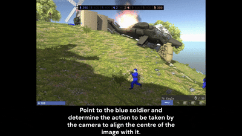

# Molmo2 VLM to VLA

This repository experiments with turning [allenai/Molmo2-4B](https://huggingface.co/allenai/Molmo2-4B) into a simple vision-language-action loop using LoRA fine-tuning. The current setup runs against a first-person shooter environment: the model receives live gameplay frames, identifies a target, and emits camera adjustment actions that are translated into keyboard input.

The project is structured as a split deployment:

- A Windows client captures the game window and sends screenshots.
- A model service runs Molmo2 plus a LoRA adapter under WSL.
- A small orchestrator triggers the end-to-end control loop.

The primary fine-tuned adapter referenced in this repo is [reubk/Molmo2toVLA-4B](https://huggingface.co/reubk/Molmo2toVLA-4B).

## What It Does

The current pipeline works as follows:

1. Capture the active game window on Windows.
2. Send the current frame to a FastAPI model service.
3. Prompt Molmo2 to locate the target and output an action vector.
4. Parse that action into directional commands.
5. Apply keyboard input to re-center the camera on the target.

This is a research prototype rather than a general-purpose VLA framework, but it provides a practical loop for experimenting with perception-to-action behavior in a live environment.

## Repository Layout

- `client/`: Windows-side agent for screen capture and keyboard actuation.
- `molmo-service/`: FastAPI service that hosts Molmo2 and the LoRA adapter.
- `orchestrator/`: Small coordinator that checks service health and starts the loop.
- `assets/`: Project media, including the demo GIF.
- `utils/`, `vla_evaluation/`: Utility scripts and evaluation code.

## Environment

This project uses `uv` for Python package management.

Because the current setup depends on Windows-native screen capture and input control, while the Molmo2 serving stack is hosted in WSL, the environment is split into two runtimes.

### Windows Environment

Use this environment for the client and orchestrator.

```powershell
uv venv .venv --python 3.12
.\.venv\Scripts\Activate.ps1
uv pip install fastapi uvicorn httpx keyboard pillow pyautogui pygetwindow pywin32 numpy
```

This side is responsible for:

- Capturing the game window
- Sending screenshots to the model service
- Executing keyboard actions
- Running the orchestration loop

### WSL Environment

Use this environment for the Molmo2 model service.

```bash
uv venv .venv --python 3.11
source .venv/bin/activate
uv pip install transformers==4.57.1 torch pillow einops torchvision accelerate decord2 molmo_utils peft bitsandbytes fastapi uvicorn python-multipart
```

WSL is used here because the serving stack and related dependencies are more practical to run there for this project.

## Running the System

Start the components in this order.

### 1. Start the model service in WSL

From the repository root:

```bash
uv run python molmo-service/app.py
```

This launches the FastAPI model service on port `8000`.

### 2. Start the Windows agent

In PowerShell from the repository root:

```powershell
uv run python client/fps_agent_client.py
```

This launches the Windows-side service on port `8001` and handles screenshot capture plus keyboard actuation.

### 3. Start the orchestrator

In another PowerShell terminal:

```powershell
uv run python orchestrator/orchestrator.py
```

The orchestrator performs health checks and starts the action loop.

## Current Assumptions

The current prototype is opinionated and environment-specific:

- It expects a Windows-hosted game window.
- The default target is currently set in the client code.
- The agent looks for a specific window title.
- The model service currently loads a local adapter checkpoint.
- The orchestration flow assumes the Windows client is available on port `8001` and the model service on port `8000`.

If you want to adapt this to a different game or simulation environment, these are the first places to change.

## Demo

Current VLA behavior in the game environment:



## Notes

This repository is an active experimentation space for:

- LoRA fine-tuning of Molmo2 for action-oriented prompting
- Vision-language-action control loops
- Evaluation of action prediction quality
- Future reinforcement learning workflows

Longer term, the plan is to move toward more controlled simulation environments such as Isaac Sim and continue exploring RL-based improvements.